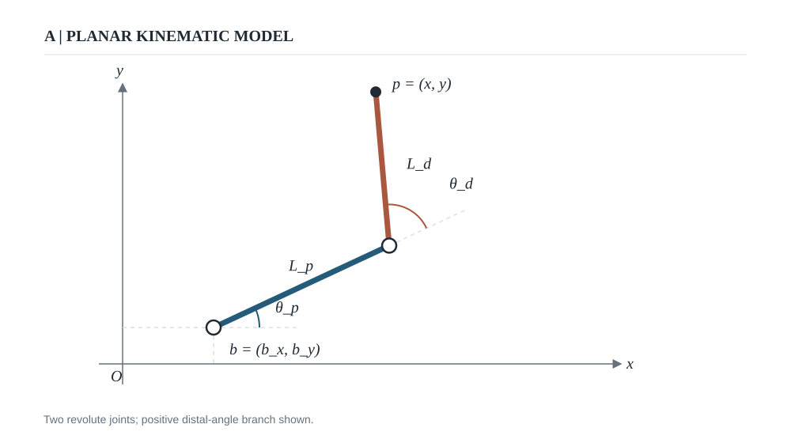
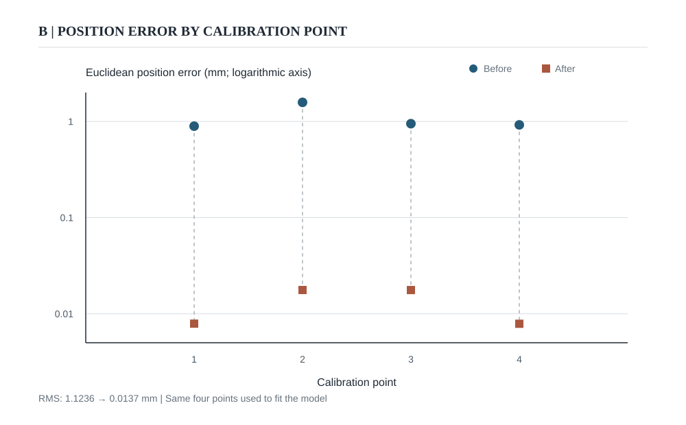
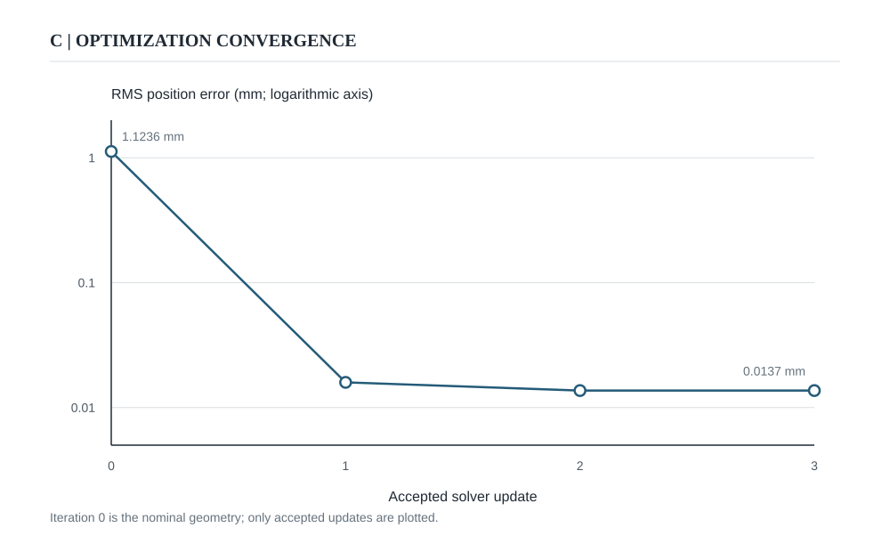

# SCARA Arm Calibration

A dependency-free Python project for calibrating a **planar, two-link SCARA arm** from paired XY positions. It estimates two link lengths, two joint reference angles, and the base position by minimizing the difference between predicted and target positions.

The repository includes a CLI, Python API, reproducible example, and automated tests. The example pairs are demonstration data from the original project; the reported fit is **not** an independent hardware accuracy measurement.



*Figure 1. Planar arm model and coordinate convention. This is a schematic; Figures 2 and 3 are computed from the repository's example data.*

## Try it in 30 seconds

Requires Python 3.10 or newer. No installation is needed to run from a clone:

```bash
git clone https://github.com/lucasmkrx/scara-arm-calibration.git
cd scara-arm-calibration
python3 -m scara_arm_calibration --input examples/sample.json
```

For the included four-point example:

```text
Calibration from 4 XY pairs (mm)
RMS position error: 1.1236 -> 0.0137 mm
Max position error: 1.5811 -> 0.0177 mm
Iterations: 4; converged: True
```

These errors describe the **fit on those four points**. Validate a calibration on additional positions that were not used during fitting before applying it to a robot.



*Figure 2. Euclidean error at each of the four fitted points. The logarithmic axis makes both the initial and final errors visible; these are training errors.*



*Figure 3. RMS error at the nominal geometry and after each accepted update. The curve is generated from the solver's recorded history.*

For machine-readable output, add `--json`. To install the console command, run `python3 -m pip install -e .` and then use `scara-calibrate --input examples/sample.json`.

## What the solver does

The arm's planar forward model is:

$$
x = b_x + L_p\cos(\theta_p) + L_d\cos(\theta_p + \theta_d)
$$
$$
y = b_y + L_p\sin(\theta_p) + L_d\sin(\theta_p + \theta_d)
$$

Here `L_p` and `L_d` are the proximal and distal link lengths; `b_x, b_y` locate the base; and `θ_p, θ_d` are joint angles in degrees.

1. Use the nominal geometry to infer a joint-angle pair from each measured XY position, choosing the positive distal-angle branch.
2. Express those angles as offsets from the nominal joint reference angles.
3. Keep each observation's offsets fixed and fit the six parameters to its target XY position.
4. Minimize the sum of squared X and Y residuals with a bounded, damped least-squares iteration. The implementation uses an analytic Jacobian and a small Gaussian elimination routine.

The CLI reports RMS Euclidean position error, maximum position error, and each point's final `predicted − target` residual. All distances use the same unit as the input coordinates; angle fields and angle bounds use degrees.

## Use your own measurements

Copy [the example input](examples/sample.json) and edit:

| Field | Meaning |
| --- | --- |
| `unit` | Label printed in the results, such as `mm`. |
| `nominal_arm` | Initial link lengths, joint reference angles, and base XY position. |
| `parameter_ranges` | Maximum change from nominal values: `length` and `base` in the coordinate unit, `angle` in degrees. Each defaults to 10 if omitted. |
| `observations` | At least four distinct `measured` XY positions paired with the intended `target` XY positions for the same commands. |

Example observation:

```json
{"target": [50, 50], "measured": [50.4, 49.2]}
```

Choose points spread across the reachable workspace. Every measured point must be strictly inside the workspace predicted by the nominal arm. An impossible point or malformed input produces a readable error and a nonzero exit status.

### Python API

```python
from scara_arm_calibration import Arm, Observation, predict_position, solve_calibration

nominal = Arm(220, 220, -49, 166, 150, -50)
pairs = [
    Observation(target=(50, 50), measured=(50.4, 49.2)),
    Observation(target=(50, 250), measured=(49.1, 248.7)),
    Observation(target=(250, 250), measured=(249.1, 249.7)),
    Observation(target=(250, 50), measured=(250.6, 49.3)),
]
result = solve_calibration(nominal, pairs)
print(result.arm, result.final_rmse)
print(predict_position((120, 200), nominal, result.arm))
```

`predict_position` applies the fitted geometry to a new measured XY point. Compare its prediction with the corresponding target on held-out points to assess whether the calibration generalizes.

## Assumptions and limits

- This is a **2D positioning model**. It does not estimate Z-axis, tool orientation, compliance, backlash, or thermal effects.
- Inverse kinematics uses the positive distal-angle branch for every point. Measurements from the other branch need a different model or explicit joint-angle observations.
- Joint offsets are inferred from measured XY positions using the nominal geometry. Their accuracy depends on that geometry and on the quality of the measurements.
- A low error on the fitted points can hide overfitting or weak parameter identification. Use more than four well-spaced points when possible, and check separate validation points.
- Bounds constrain the fit around the nominal arm; a fitted value at a bound can mean the allowed range or model needs review.

## Project layout and checks

```text
scara_arm_calibration/  solver, data models, CLI
examples/sample.json     reproducible example input
tests/                   synthetic recovery, invalid input, CLI checks
.github/workflows/ci.yml automated test matrix
scripts/generate_figures.py reproducible SVG figures
```

Run the checks locally:

```bash
python3 -m unittest discover -s tests -v
python3 scripts/generate_figures.py
```

The package has no runtime dependencies and is available under the [MIT license](LICENSE).
